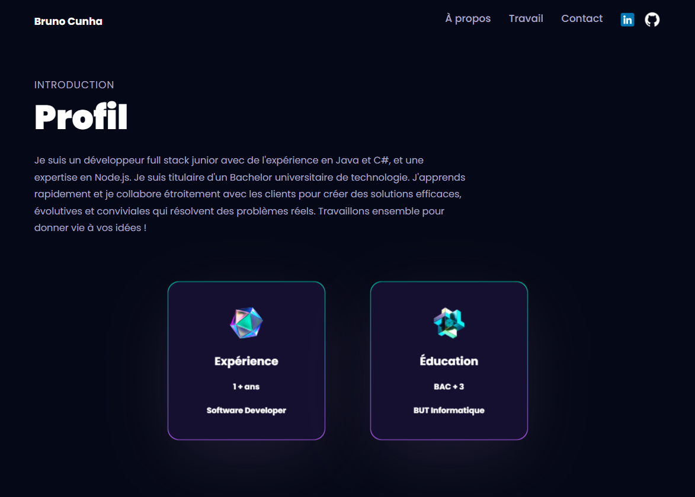
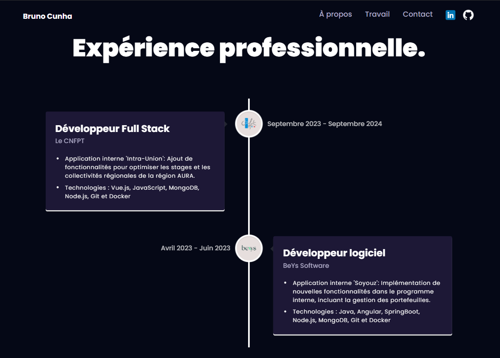
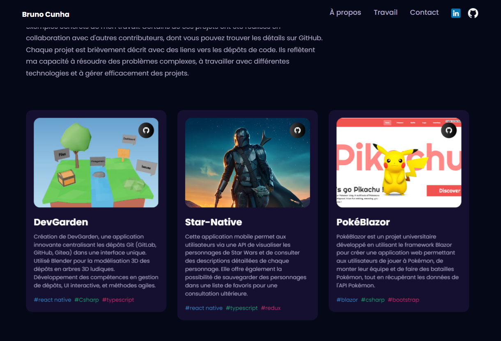
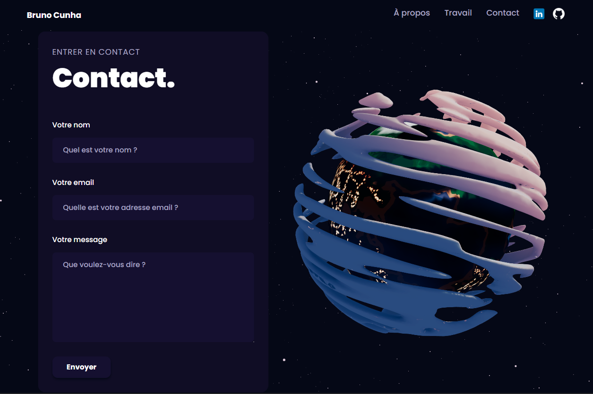

### 🌟 Portfolio de Bruno Cunha 🌟

Bienvenue sur le dépôt de mon portfolio personnel ! Ce portfolio met en avant mes compétences, mes expériences professionnelles et mes projets.

### 🚀 Technologies utilisées

- **ReactJS** : Pour la création de l'interface utilisateur.
- **ThreeJS** : Pour les animations 3D.
- **Tailwind CSS** : Pour le style et la mise en page.
- **JavaScript** : Pour la logique et les interactions dynamiques.

### 📂 Sections du portfolio


#### 1. Accueil

La section "À propos" donne un aperçu de mon parcours et de mes compétences.


#### 2. À propos

La section "À propos" donne un aperçu de mon parcours et de mes compétences.



#### 3. 💼 Expérience Professionnelle

Cette section présente mes expériences professionnelles avec des descriptions détaillées de chaque poste.



#### 4. 🛠️ Projets

La section "Projets" présente les différents projets sur lesquels j'ai travaillé, avec des descriptions et des liens vers les dépôts GitHub.



#### 5. 📞 Contact

Cette section permet aux visiteurs de me contacter via un formulaire intégré.



### 🔧 Installation et utilisation

1. Clonez le dépôt sur votre machine locale :

```bash
git clone https://github.com/votre-utilisateur/portfolio.git
```

2. Installez les dépendances nécessaires :

```bash
cd portfolio
npm install
```

3. Lancez l'application en mode développement :

```bash
npm run dev
```

### 🌐 Lien vers le portfolio

Vous pouvez visiter mon portfolio en ligne en suivant: https://bruno-cunha.com/

### 👨‍💻 Auteur

Bruno Cunha

### 🙏 Remerciements

Merci d'avoir pris le temps de visiter et d'explorer mon portfolio. N'hésitez pas à me contacter pour toute question ou collaboration !

---
